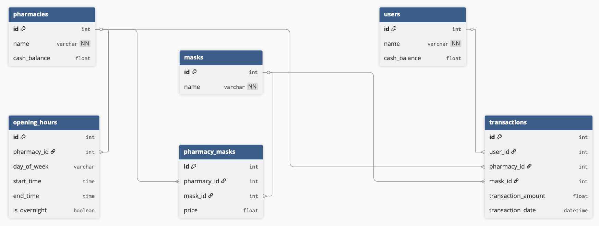

## A. Required Information
### A.1. Requirement Completion Rate

- [x] List all pharmacies open at a specific time and on a day of the week if requested.  
  - Implemented at `GET /pharmacies/open`
  
- [x] List all masks sold by a given pharmacy, sorted by mask name or price.  
  - Implemented at `GET /pharmacies/{name}/masks`
  
- [x] List all pharmacies with more or less than x mask products within a price range.  
  - Implemented at `GET /pharmacies/filter_by_mask_count`
  
- [x] The top x users by total transaction amount of masks within a date range.  
  - Implemented at `GET /users/top`
  
- [x] The total number of masks and dollar value of transactions within a date range.  
  - Implemented at `GET /summary`
  
- [x] Search for pharmacies or masks by name, ranked by relevance to the search term.  
  - Implemented at `GET /search?query_name=...&search_type=pharmacy|mask`
  
- [x] Process a user purchases a mask from a pharmacy, and handle all relevant data changes in an atomic transaction.  
  - Implemented at `POST /purchase`


### A.2. API Document

I used **FastAPI** to implement the server, and it provides interactive API documentation automatically.

You need to run server first by following scripts:
```bash
PYTHONPATH=. python app/main.py
```

Then you can test and view all endpoints through Swagger UI at:

👉 `http://localhost:8000/docs`

This includes route parameters, input/output formats, and sample responses.

> You can also directly use [this](./document/openapi-resolved.yaml) to get the complete OpenAPI specification file.
> 
> - Usable with Postman, Swagger Editor, or any tool that supports OpenAPI 3.0.
> - Simply drag and drop or import `document/openapi-resolved.yaml` to browse all API structure, parameters, response formats, and examples.


### A.3. Import Data Commands
To load the raw data into the database, run the following scripts:

```bash
# Step 1: Initialize database schema
PYTHONPATH=. python app/init_db.py

# Step 2: Run the ETL process (transform & load data)
PYTHONPATH=. python app/etl.py
```


## B. Bonus Information18753
### B.1. Test Coverage Report

I wrote 20+ unit tests using `pytest` and FastAPI’s `TestClient` to verify core functionalities.

The tests cover:
- ✅ Root endpoint
- ✅ Pharmacies: open time filter, mask listing, and price filters
- ✅ Users: top users by transaction
- ✅ Summary: total mask sold and value
- ✅ Search: relevance-based pharmacy/mask lookup
- ✅ Purchase: valid + error flows
- ✅ Input validation and exception handling

Please check the test coverage report at below.
```bash
==================================== tests coverage ====================================
___________________ coverage: platform darwin, python 3.13.3-final-0 ___________________

Name                    Stmts   Miss  Cover   Missing
-----------------------------------------------------
app/api/__init__.py         0      0   100%
app/api/pharmacies.py      52      4    92%   90, 92, 109, 138
app/api/purchase.py        55      4    93%   54, 62, 105-106
app/api/search.py          50      3    94%   21, 36, 118
app/api/summary.py         22      0   100%
app/api/users.py           21      0   100%
app/db.py                   6      0   100%
app/main.py                28      4    86%   44, 51, 58-59
app/models.py              51      0   100%
-----------------------------------------------------
TOTAL                     285     15    95%
================================== 23 passed in 0.20s ==================================
```

You can run the test script by using the command below:

```bash
PYTHONPATH=. pytest --cov=app --cov-report=term-missing --cov-config=.coveragerc
```


### B.2. Dockerized

I have fully Dockerized the FastAPI application using a `Dockerfile` based on Python 3.12.

Please check my Dockerfile at [here](./Dockerfile).

On the local machine, please follow the commands below to build it.
```bash
docker build -t phantom-mask-api .
```

Run the app in a container:
```bash
docker run -p 8000:8000 phantom-mask-api
```

Then access the API at:
👉 `http://localhost:8000/docs`


## C. Other Information

### C.1. ERD

My ERD.



---
